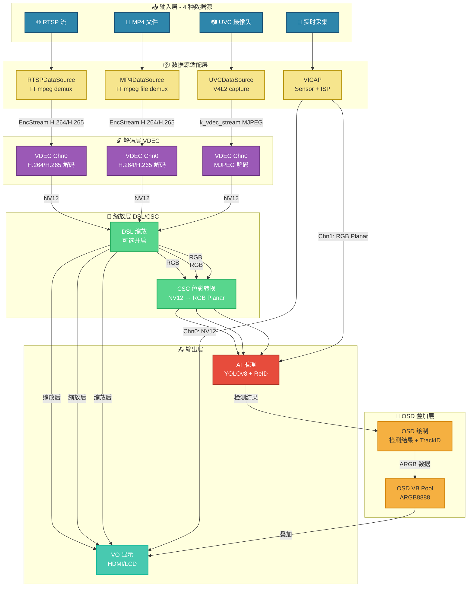

# K230 MultiSource AI Analyzer

🎯 **一个支持多种输入源的 K230 AI 视频分析 Demo**

---

## 📖 目录

1. [项目简介](#-项目简介)
2. [快速开始](#-快速开始)
3. [系统架构](#-系统架构)
4. [代码结构](#-代码结构)
5. [数据流详解](#-数据流详解)
6. [AI Pipeline](#-ai-pipeline)
7. [配置说明](#-配置说明)
8. [适用场景](#-适用场景)

---

## 📌 项目简介

### 核心特性

本 Demo 的**最大亮点**是支持 **4 种不同的视频输入源**，所有输入源都能无缝接入同一套 AI 分析 pipeline（YOLOv8 检测 + ReID 特征 + BoTSORT 跟踪）：

| 输入源 | 类型 | 典型场景 |
|--------|------|----------|
| 🌐 **RTSP** | 网络视频流 | 接入已有 IPC 摄像头、NVR 系统 |
| 📁 **MP4** | 本地视频文件 | 离线测试、算法验证、回放分析 |
| 📷 **UVC** | USB 摄像头 | 快速原型开发、外接 USB 相机 |
| 🎥 **Realtime** | K230 原生采集 | 生产环境、板载 Sensor 实时推理 |

**无需修改 AI 代码**，只需切换启动参数即可适配不同场景！

### AI 能力

| 模块 | 功能 | 模型 |
|------|------|------|
| **YOLOv8** | 目标检测 | yolov8s.kmodel |
| **ReID** | 外观特征提取 | reid.kmodel |
| **BoTSORT** | 多目标跟踪 | - |

---

## 🚀 快速开始

### 编译

#### 1️⃣ 启用 Multisource AI Analyzer

在 K230 SDK 根目录下运行配置命令 `make menuconfig`，进入配置界面：

```
Config -> RT-Smart UserSpace Examples Configuration -> Enable build integrated examples
```

确保选中以下选项（按 `<Y>` 启用）：

```
[*] Multisource AI Analyzer
```

**操作说明：**
- 使用 **↑↓ 箭头键** 导航
- 按 **`<Y>`** 启用选项（`[*]` 表示已启用）
- 按 **`<N>`** 禁用选项（`[ ]` 表示禁用）
- 按 **`<Enter>`** 进入子菜单
- 配置完成后保存退出

#### 2️⃣ 保存配置并编译

返回 SDK 根目录，保存配置并编译整个项目：

```bash
make savedefconfig
make
```

**编译输出位置：**
```
src/rtsmart/examples/elf/integrated_poc/multisource_ai_analyzer.elf
```

#### 3️⃣ 烧录固件

将编译生成的固件烧录到开发板后，可执行文件位于板子目录：

```
/sdcard/app/examples/integrated_poc/multisource_ai_analyzer
```

**运行方式：**
通过串口登录开发板，进入目录并运行：

```bash
cd /sdcard/app/examples/integrated_poc
./multisource_ai_analyzer <参数>
```

### 运行命令格式

仅需提供视频路径，其他参数全部可选!

```bash
./multisource_ai_analyzer.elf [OPTIONS] <video_path>
```

### 参数说明

#### 必需参数

| 参数 | 含义 | 示例值 | 说明 |
|------|------|--------|------|
| video_path | 视频源路径 | rtsp://... / *.mp4 / uvc / realtime | 支持 RTSP 流、MP4 文件、UVC 摄像头、实时采集 |

#### 可选参数

| 参数 | 含义 | 默认值 | 说明 |
|------|------|--------|------|
| --det-model <path> | YOLOv8 检测模型路径 | yolov8n_320.kmodel | YOLOv8 目标检测的 kmodel 文件路径 |
| --score-thres <float> | 目标检测置信度阈值 | 0.4 | 低于该阈值的检测结果将被过滤 |
| --nms-thres <float> | 目标检测 NMS 阈值 | 0.6 | 非极大值抑制阈值，用于去除重复检测框 |
| --reid-model <path> | ReID 特征模型路径 | feature.kmodel | 外观特征提取的 kmodel 文件路径 |
| --track-high <float> | 高置信度阈值 | 0.6 | 高于该值的检测被视为可靠目标 |
| --track-low <float> | 低置信度阈值 | 0.2 | 低于该值的检测将被丢弃 |
| --new-track <float> | 新建轨迹阈值 | 0.75 | 只有高于该值的检测才能生成新轨迹 |
| --frame-buffer <int> | 轨迹缓冲大小 | 600 | 未匹配情况下轨迹的最大保留帧数 |
| --match-thresh <float> | 最大匹配代价阈值 | 0.9 | IOU/距离超过该值视为不匹配 |
| --proximity <float> | 邻近匹配阈值 | 0.3 | 中心距离或 IOU 阈值 |
| --appearance <float> | ReID 外观特征距离阈值 | 0.2 | 数值越小，外观匹配越严格 |
| --lambda <float> | IOU/ReID 权重因子 | 0.99 | 越接近 1 越依赖 IOU |
| --debug <0|1|2> | 调试模式 | 0 | 0=关闭，1=简单调试，2=详细调试 |
| --help | 显示帮助信息 | - | 显示使用说明并退出 |

### 四种输入源启动示例

##### RTSP 流输入

```bash
# 最简单用法 (全部使用默认值)
./multisource_ai_analyzer.elf "rtsp://192.168.1.100:554/stream1"

# 自定义检测模型和阈值
./multisource_ai_analyzer.elf --det-model yolov8m_640.kmodel --score-thres 0.6 "rtsp://192.168.1.100:554/stream1"
```
请将 rtsp://192.168.1.100:554/stream1 替换为你的实际 RTSP 流地址

##### MP4 文件输入

```bash
# 使用默认参数
./multisource_ai_analyzer.elf "test_video.mp4"

# 调整跟踪参数
./multisource_ai_analyzer.elf --track-high 0.7 --track-low 0.3 --new-track 0.8 "test_video.mp4"
```
请将 test_video.mp4 替换为你的实际 MP4 文件路径

##### UVC 摄像头输入

```bash
# 最简单用法
./multisource_ai_analyzer.elf uvc

# 启用调试模式
./multisource_ai_analyzer.elf --debug 1 uvc
```
uvc 为固定参数，无需修改

##### Realtime 原生采集

```bash
# 最简单用法
./multisource_ai_analyzer.elf realtime

# 自定义所有参数
./multisource_ai_analyzer.elf --det-model yolov8n_320.kmodel --score-thres 0.5 --debug 1 realtime
```
realtime 为固定参数，无需修改

### 查看帮助

运行以下命令查看完整的参数说明:

```bash
./multisource_ai_analyzer.elf --help
```

输出示例:

```
Usage: multisource_ai_analyzer.elf [OPTIONS] <video_path>

Required:
  <video_path>              视频源路径，支持以下类型:
                            - "realtime"   实时摄像头采集
                            - "*.mp4"      MP4 视频文件
                            - "UVC"        UVC 摄像头
                            - "rtsp://*"   RTSP 网络视频流

Optional:
  --det-model <path>        YOLOv8 检测模型路径 (默认：yolov8n_320.kmodel)
  --score-thres <float>     检测置信度阈值 (默认：0.4)
  --nms-thres <float>       NMS 阈值 (默认：0.6)
  --reid-model <path>       ReID 特征模型路径 (默认：feature.kmodel)
  --track-high <float>      高置信度阈值 (默认：0.6)
  --track-low <float>       低置信度阈值 (默认：0.2)
  --new-track <float>       新建轨迹阈值 (默认：0.75)
  --frame-buffer <int>      轨迹缓冲大小 (默认：600)
  --match-thresh <float>    匹配代价阈值 (默认：0.9)
  --proximity <float>       邻近匹配阈值 (默认：0.3)
  --appearance <float>      外观特征距离阈值 (默认：0.2)
  --lambda <float>          IOU/ReID 权重因子 (默认：0.99)
  --debug <0|1|2>           调试模式 (默认：0)
  --help                    显示此帮助信息

Examples:
  multisource_ai_analyzer.elf "rtsp://192.168.1.100:554/stream1"
  multisource_ai_analyzer.elf --det-model yolov8n_320.kmodel --score-thres 0.5 "realtime"
  multisource_ai_analyzer.elf --debug 1 --track-high 0.7 test.mp4
```

---

## 🏗️ 系统架构

### 完整 Pipeline 架构图



### ASCII 简化架构

```
┌─────────────────────────────────────────────────────────────────┐
│                        输入适配层                                │
│  ┌─────────┐  ┌─────────┐  ┌─────────┐  ┌─────────────────┐    │
│  │  RTSP   │  │   MP4   │  │   UVC   │  │    Realtime     │    │
│  │ FFmpeg  │  │ FFmpeg  │  │  V4L2   │  │  VICAP + ISP    │    │
│  └────┬────┘  └────┬────┘  └────┬────┘  └────────┬────────┘    │
└───────┼────────────┼────────────┼─────────────────┼─────────────┘
        │            │            │                 │
        ▼            ▼            ▼                 ▼
┌─────────────────────────────────────────────────────────────────┐
│                        统一解码层                                │
│              VDEC (H.264/H.265/MJPEG)   │    VICAP 双通道       │
│      RTSP/MP4/UVC → VDEC → NV12         │    Chn0(NV12)        │
│                              ┌──────────┴──────────┐           │
│                              │                     │           │
│                              ▼                     ▼           │
│                    ┌─────────────────┐   ┌─────────────────┐   │
│                    │   DSL 缩放       │   │   CSC 色彩转换   │   │
│                    └────────┬────────┘   └────────┬────────┘   │
│                             │                     │            │
│                             ▼                     ▼            │
│                    ┌─────────────────┐   ┌─────────────────┐   │
│                    │   VO 显示        │   │   AI 推理        │   │
│                    │  (HDMI/LCD)     │   │ (YOLO+ReID)     │   │
│                    └─────────────────┘   └─────────────────┘   │
└─────────────────────────────────────────────────────────────────┘
```

---

## 📁 代码结构

```
multisource_ai_analyzer/
├── src/
│   ├── video_pipeline.*           # Realtime 模式 pipeline（VICAP 采集）
│   ├── video_stream_pipeline.*    # RTSP/MP4/UVC 模式 pipeline
│   │   ├── mpp_pipeline.*         # MPP 核心 pipeline（VDEC/DSL/CSC/VO）
│   │   └── video_source/          # 数据源实现
│   │       ├── rtsp_data_source.* # RTSP 流解析（FFmpeg）
│   │       ├── mp4_data_source.*  # MP4 文件解析（FFmpeg）
│   │       └── uvc_data_source.*  # UVC 摄像头采集（V4L2）
│   ├── yolov8_det.*               # YOLOv8 检测封装
│   ├── feature.*                  # ReID 特征提取
│   ├── main.cc                    # 程序入口
│   └── setting.h                  # 配置宏定义
├── botsort/                       # BoTSORT 多目标跟踪器
├── Makefile                       # 编译脚本
└── README.md                      # 本文档
```

### 核心模块说明

| 模块 | 文件 | 功能 |
|------|------|------|
| **主入口** | `main.cc` | 参数解析、线程启动、AI pipeline 调度 |
| **Realtime Pipeline** | `video_pipeline.*` | K230 原生 Sensor 采集，VICAP 双通道输出 |
| **Stream Pipeline** | `video_stream_pipeline.*` | RTSP/MP4/UVC 统一处理框架 |
| **MPP Pipeline** | `mpp_pipeline.*` | VDEC 解码、DSL 缩放、CSC 转换、VO 显示 |
| **RTSP 数据源** | `rtsp_data_source.*` | FFmpeg RTSP 拉流、解复用 |
| **MP4 数据源** | `mp4_data_source.*` | FFmpeg MP4 文件读取、解复用 |
| **UVC 数据源** | `uvc_data_source.*` | V4L2 UVC 摄像头采集 |
| **YOLOv8 检测** | `yolov8_det.*` | YOLOv8 模型加载、推理、后处理 |
| **ReID 特征** | `feature.*` | 外观特征提取模型推理 |
| **BoTSORT** | `botsort/` | 多目标跟踪算法 |

---

## 📊 数据流详解

### 各输入源数据流

| 输入源 | 编码格式 | 解码方式 | 显示通路 (VO) | AI 通路 |
|--------|----------|----------|---------------|---------|
| **RTSP** | H.264 / H.265 | VDEC 硬解码 | RTSP → FFmpeg → VDEC → NV12 → DSL → **VO** | RTSP → FFmpeg → VDEC → NV12 → DSL → CSC → RGB → **AI** |
| **MP4** | H.264 / H.265 | VDEC 硬解码 | MP4 → FFmpeg → VDEC → NV12 → DSL → **VO** | MP4 → FFmpeg → VDEC → NV12 → DSL → CSC → RGB → **AI** |
| **UVC** | MJPEG | VDEC JPEG 解码 | UVC → V4L2 → VDEC(JPEG) → NV12 → DSL → **VO** | UVC → V4L2 → VDEC(JPEG) → NV12 → DSL → CSC → RGB → **AI** |
| **Realtime** | RAW (ISP 输出) | VICAP 直通 | Sensor → ISP → VICAP → **Chn0(NV12) → VO** | Sensor → ISP → VICAP → **Chn1(RGB) → AI** |

### 数据流特点

- **RTSP/MP4/UVC**：解码后的 NV12 数据**同时输出两路** → 一路经 DSL 直接送 VO 显示，一路经 CSC 转 RGB 送 AI 推理
- **Realtime**：VICAP 硬件级双通道 → Chn0 专用于显示 (NV12)，Chn1 专用于 AI(RGB Planar)，零拷贝高效传输

---

## 🧠 AI Pipeline

### 处理流程

```
1. YOLOv8 检测目标（人/车/物）
        ↓
2. 对每个检测框提取 ReID 特征
        ↓
3. BoTSORT 进行多帧关联，输出稳定 TrackID
        ↓
4. 结果通过 OSD 叠加到视频上
```

---

## 🛠️ 配置说明

### 核心配置项

编辑 `src/setting.h`，只有两个核心配置项：

```c
// ================================
// 显示类型配置
// ================================
#define DISPLAY_TYPE 'st7701'   // 'st7701' = LCD 屏 (800x480), 'lt9611' = HDMI (1920x1080)

// ================================
// RTSP 传输协议配置
// ================================
#define RTSP_RTP_OVER_TCP 1     // 1 = RTP over TCP (跨网络/防火墙/网络不稳定), 0 = RTP over UDP (局域网/低延迟)
```

### DISPLAY_TYPE 详解

| 值 | 显示设备 | 分辨率 | 适用场景 |
|----|----------|--------|----------|
| `'st7701'` | LCD 触摸屏 | 800x480 | 便携式设备、嵌入式开发板 |
| `'lt9611'` | HDMI 显示器 | 1920x1080 | 桌面显示器、电视 |

**修改后会自动调整以下参数：**

| 参数 | st7701 | lt9611 |
|------|--------|--------|
| `DISPLAY_WIDTH` | 800 | 1920 |
| `DISPLAY_HEIGHT` | 480 | 1080 |
| `AI_FRAME_WIDTH` | 800 | 1920 |
| `AI_FRAME_HEIGHT` | 480 | 1080 |
| `DISPLAY_MODE` | 1 (旋转 90°) | 0 (不旋转) |

### RTSP_RTP_OVER_TCP 详解

| 值 | 传输协议 | 适用场景 |
|----|----------|----------|
| `1` (TCP) | RTP over TCP | 跨网络、有防火墙、网络不稳定（丢包重传） |
| `0` (UDP) | RTP over UDP | 局域网、网络稳定、追求低延迟 |

**选择建议：**
- 局域网内测试 → 用 `0` (UDP) 延迟更低
- 跨网络/互联网 → 用 `1` (TCP) 更稳定
- 有防火墙/NAT → 用 `1` (TCP) 穿透更容易

## 🎯 适用场景

| 场景 | 推荐输入源 | 说明 |
|------|------------|------|
| **产品演示** | Realtime | 展示 K230 原生性能 |
| **算法调试** | MP4 | 可重复测试同一视频 |
| **系统集成** | RTSP | 接入现有监控系统 |
| **快速验证** | UVC | 外接 USB 相机快速原型 |

---
